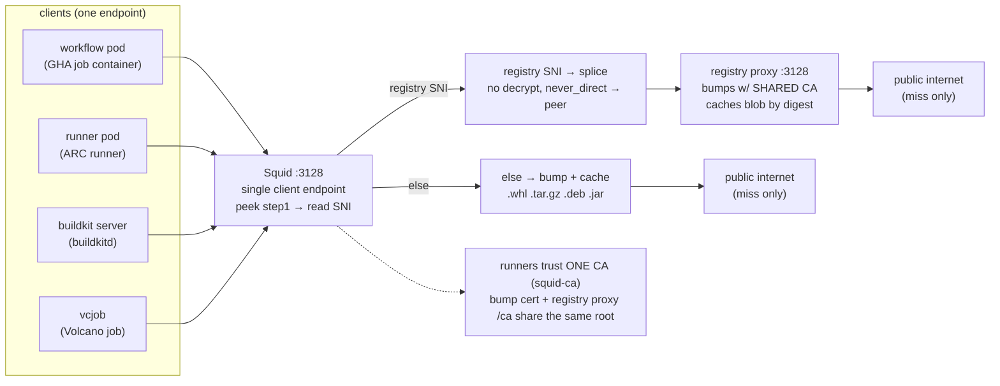

# Squid Caching Forward Proxy — Overview, Scenarios & Usage

## 1. What it is

A caching forward proxy (MITM/SSL-bump) deployed in the `squid` namespace of the gy006 cluster, plus an optional registry cache sidecar. Everything is defined in `squid-rpardini/chart` (Helm chart):

```
squid-cache (StatefulSet, ns: squid)
├── squid            :3129  Squid 6 (SSL bump + cache)         ── alpine image
├── registry-proxy   :3128  rpardini/docker-registry-proxy      ── sidecar, caches container images
├── squid-exporter   :9301  cachemgr → Prometheus               ── sidecar
└── service squid-cache:3128 → targetPort 3129 (squid)
```

The cluster-facing entrypoint is `http://squid-cache.squid.svc.cluster.local:3128`.

### 1.1 SSL Bump

| Directive | Value | Meaning |
|---|---|---|
| `http_port 3129 ssl-bump` | `cert=…/squid-ca-bundle.pem`, `generate-host-certificates=on` | MITM HTTPS: squid presents a per-host cert signed by the internal CA |
| `sslcrtd_program security_file_certgen` | 8MB dynamic cert cache | on-the-fly certificate generation |
| `acl registry` | `swr.*`, `registry-1.docker.io`, `registry.k8s.io`, `ghcr.io`, `gcr.io`, `quay.io` | registries that are **spliced** (no bump — certs must stay pristine) |
| `ssl_bump peek step1` / `splice registry` / `bump all` | | peek SNI first, splice known registries, bump everything else |
| `acl localnet src all` + `allow localnet` | | open proxy inside the cluster |

Only non-registry HTTPS traffic is bumped. Image pulls through the registry sidecar are spliced so container image signatures and certs are untouched.

### 1.2 Caching

```
cache_mem 512 MB
cache_dir ufs /var/spool/squid 20GB 16 8
maximum_object_size 8 GB
```

`refresh_pattern` overrides force long-lived caching for `.whl`, `.tar.gz`, `.deb`, PyPI/Go proxy/golang/debian/ubuntu paths, and strip `Vary: Accept-Encoding` to avoid cache misses.

### 1.3 Registry sidecar (`cache_peer`)

```
cache_peer 127.0.0.1 parent 3128 0 no-query no-digest name=registryproxy
cache_peer_access registryproxy allow registry
never_direct allow registry
```

Traffic to the `acl registry` hosts is redirected to the in-pod rpardini sidecar, which proxies `docker pull`/`push` with a 200Gi (100Gi HK) disk cache. `allowPush: true` keeps `buildctl push` working through the cache.

### 1.4 Data / PVCs

| PVC | Size | StorageClass | Used by |
|---|---|---|---|
| `squid-cache-pvc` | 50Gi | sfsturbo-subpath-sc | squid `cache_dir` |
| `registry-cache-pvc` | 200Gi | sfsturbo-subpath-sc | registry proxy image cache |

CA material comes from the `squid-ca` secret (`squid-ca-bundle.pem`); an init container splits bundle → `ca.crt` + `ca.key` for the registry proxy (`emptyDir`).

## 2. Scenarios

**One endpoint, two internal paths** — all four client types point `http_proxy` at the same
`http://squid-cache.squid.svc.cluster.local:3128`. Squid peeks the SNI, **splices** registry
hostnames (tunnel untouched) to the rpardini sidecar, and **bumps + caches** everything else.



### 2.1 Workflow pod / runner pod outbound traffic (env-var based)

Runner job pods (e.g. `other/nv-action/vllm-benchmarks/config-for-guiyang-006/linux-*-cpu-4-buildkit-configmap.yaml`) set proxy env vars so **all** tool traffic goes through squid — the workflow job container (`container:` block, run inside the runner pod) inherits the same env:

```yaml
HTTP_PROXY / HTTPS_PROXY / http_proxy / https_proxy = http://squid-cache.squid.svc.cluster.local:3128
NO_PROXY   / no_proxy  = localhost,127.0.0.1,.buildkitd,.svc.cluster.local,.cluster.local
```

Because squid SSL-bumps HTTPS, the pod must trust the squid CA:

```yaml
SSL_CERT_FILE / CURL_CA_BUNDLE / REQUESTS_CA_BUNDLE / GIT_SSL_CAINFO / PIP_CERT / NODE_EXTRA_CA_CERTS = /etc/squid-ca/squid-ca.pem
```

The CA file is mounted via the `squid-ca-cert` ConfigMap (`/etc/squid-ca`); the postStart hook additionally installs it into the system trust store (Debian `ca-certificates.crt` append / RHEL `ca-trust anchors` + extract) for `apt`/`yum`/`dnf`, which only read the compiled bundle. Vault-injected mTLS certs (`/home/user/.docker/*.pem`) let `buildctl` talk to buildkitd directly (NO_PROXY).

### 2.2 buildkit server image pulls / pushes (sidecar)

buildkitd itself has no proxy env; its registry traffic goes through the rpardini sidecar. `buildctl build --output push=true` also hits the sidecar (`ALLOW_PUSH=true`), so base images and build outputs are cached cluster-wide. Runner-side `buildctl` gRPC (mTLS) bypasses the proxy via `NO_PROXY` and hits `buildkitd-service.buildkitd:1234` directly.

### 2.3 vcjob outbound traffic (env-var based)

Volcano batch jobs (`vcjob`) set the same proxy + CA env and mount `squid-ca-cert`; they are plain clients of the single squid endpoint — no buildkit involved. Best-effort CA install in the entrypoint keeps the job alive if the mount is missing.

### 2.4 `RUN` steps inside builds (transparent proxy network) — see §4

## 3. Usage

### 3.1 Curl / git / pip behind squid

```bash
export https_proxy=http://squid-cache.squid.svc.cluster.local:3128
export SSL_CERT_FILE=/etc/squid-ca/squid-ca.pem
curl -fsSL https://github.com/...        # bumped + cached
git clone https://github.com/...         # GIT_SSL_CAINFO if git < 2.30
```

### 3.2 Verify squid is healthy

```bash
curl -x http://squid-cache.squid.svc.cluster.local:3128 -o /dev/null -s -w '%{http_code}\n' https://github.com/
# 200
```

### 3.3 Deploy the chart

```bash
helm install squid-cache ./squid-rpardini/chart -f values.yaml -n squid --kubeconfig ~/.kube/gy-006.yaml
```

### 3.4 buildctl end-to-end

```bash
buildctl --addr tcp://buildkitd-service.buildkitd:1234 --tlscacert … --tlscert … --tlskey … \
  build --frontend dockerfile.v0 --local context=. --local dockerfile=. \
  --opt filename=Dockerfile.openEuler --opt platform=linux/arm64 --progress=plain \
  --output type=image,name=quay.io/atlas-ci/vllm-atlas-temp:tag,push=true
```

## 4. Special case: `RUN` proxy (buildkit `--proxy-network`)

### 4.1 The problem

The runner pod's `HTTP_PROXY` env vars **do not** reach the containers spawned by buildkitd for `RUN` steps. Those exec containers run in buildkitd's own network namespace with a clean environment. Result:

- `RUN pip install …`, `RUN git clone …`, `RUN apt-get …` made **direct** internet connections, bypassing squid entirely — no caching, no central egress control.
- Even setting `ARG/ENV http_proxy` in every Dockerfile doesn't fix TLS: the squid CA must also be trusted inside every build container, which requires baking the CA into the base image or copying it per build.

### 4.2 The solution: internal MITM proxy + upstream squid

A custom buildkitd image (`swr…/modelfoundry/moby/buildkit:v0.31.x-proxy`, source: `buildkit-proxy/` — rootful stage, `--target buildkit-linux`) adds a **proxy network provider** plus three flags:

```
--proxy-network                enable the proxy network for RUN steps
--proxy-upstream-url          http://squid-cache.squid.svc.cluster.local:3128
--proxy-upstream-cacert       /etc/squid-ca/squid-ca.pem   (squid CA mounted via squid-ca volume)
```

How it works, per `RUN` step (see `util/network/proxyprovider/provider_linux.go`, `executor/runcexecutor/executor.go`):

```
RUN process (build container)
   │  env injected: HTTP_PROXY/HTTPS_PROXY/http_proxy/https_proxy → http://10.89.x.x:port (internal)
   │                 NO_PROXY=127.0.0.1,localhost,::1
   ▼
internal Go MITM proxy (own netns, veth to build netns)
   │  ephemeral CA + per-host leaf certs (generated on the fly, 24h lifetime)
   │  rootfs gets ProxyCA injected into system bundle (InjectionProxyCA) — transient, cleaned up
   ▼
upstream forward proxy: squid (:3128)          ← via --proxy-upstream-url
   ▼
internet
```

- Buildkitd runs its own MITM proxy in a dedicated network namespace; it forwards every request through the configured upstream squid, so **RUN traffic is cached and controlled exactly like runner traffic**.
- The internal proxy's CA is injected into the build container's system trust bundle automatically, so TLS to the MITM proxy succeeds without any Dockerfile change.
- `--proxy-upstream-cacert` lets the internal proxy verify squid's TLS (squid bumps it as "a normal client"). Known limitation: Go's `net/http` has one TLS config per transport, so the upstream CA is appended to the trust pool used for **all** TLS connections of that transport.
- Egress mode: defaults to buildkitd's default network mode; `--network=host` RUN steps use the host provider as egress (egress providers map in `netproviders/network.go`).

### 4.3 Why it must be rootful (not rootless)

The proxy network provider manipulates real kernel network infrastructure **per RUN step** — this is impossible under rootlesskit (the `-rootless` image runs buildkitd as UID 1000 inside a user namespace with slirp4netns userspace networking). Per step it needs:

| Privileged op | Where | Requires |
|---|---|---|
| `unshare(CLONE_NEWNET)` + bind-mount of `/proc/…/ns/net` | `provider_linux.go:994` (`createNetNS`) | `CAP_SYS_ADMIN` in the owning user namespace |
| create veth pair, move it between the two fresh netns | `provider_linux.go:350` (`setupVeth`), `netlink.LinkAdd`/`LinkSetNsFd` | `CAP_NET_ADMIN` in source **and** target netns |
| TCP listener inside the proxy netns | `listenInNetNS` + `withNetNS` (`setns`) | real netns access — slirp4netns has none |
| egress via CNI bridge (`cni.json`, bridge/firewall plugins) | `netproviders/network.go` default mode | bridge + iptables in the **initial/host** netns — impossible for a userns process |

The fork's own integration tests are suffixed `NoRootless` and skipped when the worker runs rootless (`util/testutil/integration/run.go:223`), so the feature is only designed/validated for a rootful daemon.

This is exactly why the branch switches the deployment to rootful (see `argocd/clusters/buildkit-server/values-guiyang-006-arm64.yaml`):

```yaml
image: swr…/moby/buildkit:v0.31.x-proxy        # rootful stage: ENTRYPOINT ["buildkitd-entrypoint"], runs as root
securityContext:
  privileged: true
  seccompProfile: {type: Unconfined}
  appArmorProfile: {type: Unconfined}
# runAsUser/runAsGroup removed — runs as root
# --oci-worker-no-process-sandbox removed — rootful uses real sandbox
# --oci-worker-snapshotter fuse-overlayfs removed — rootful uses native overlayfs
```

### 4.4 Risks of running rootful

1. **Host compromise surface (the big one).** buildkitd executes arbitrary Dockerfile `RUN` steps as root, with `privileged: true` and seccomp/AppArmor unconfined. A malicious or compromised build step can escape the container (kernel exploits, device access, module loading) and take over the node/cluster. The `-rootless` image existed precisely to contain this.
2. **Network isolation weakened.** `CAP_NET_ADMIN` + per-step netns in a privileged pod means a compromised build can sniff/forge traffic inside its netns and manipulate host-level networking the daemon shares; the proxy-provider isolation is only as strong as the rootful daemon itself.
3. **MITM trust injected into every build.** The executor appends the ephemeral proxy CA to each build container's system trust bundle (`executor/proxyca_linux.go`). Whoever can execute a RUN step holds a CA trusted by that build — and in rootful mode the daemon's TLS keys for the `:1234` mTLS listener are readable by the root process too.
4. **Squid becomes the single point of failure for builds.** All RUN egress goes through the chain internal-proxy → squid. If squid is down, the upstream URL is wrong, or the CA mismatches, every RUN step fails with 502 (`--proxy-upstream-cacert` is validated at daemon startup, but the squid endpoint itself is still an SPOF).
5. **Extra hop latency.** Every RUN HTTP request now traverses an in-pod Go MITM proxy + squid. TLS to the internal proxy is re-negotiated per step (leaf certs, 24h lifetime, LRU 1024); large downloads (model weights, base images) pay the double-hop cost.
6. **Resource leaks on hard kills.** `graceful_stop`/redeploys mid-build leave netns + veth pairs behind; `cleanOldNamespaces` (`provider_linux.go:952`) reclaims leftovers on next startup, but only a rootful daemon has the privileges to delete them.
7. **Cluster admission constraints.** `privileged: true` + unconfined profiles require the namespace to permit privileged workloads (PSS/PSA, admission policies); hardened node kernels (SELinux/AppArmor enforcing, locked-down sysctls) may block the netns/veth syscalls entirely.

### 4.5 Enabling it

Deployment patch (see `buildkit-proxy/patch-buildkitd-{arm64,amd64}.json`):

```bash
kubectl --kubeconfig ~/.kube/gy-006.yaml -n buildkitd patch deployment buildkitd-arm64-deployment \
  --type='json' -p "$(cat buildkit-proxy/patch-buildkitd-arm64.json)"
kubectl --kubeconfig ~/.kube/gy-006.yaml -n buildkitd patch deployment buildkitd-amd64-deployment \
  --type='json' -p "$(cat buildkit-proxy/patch-buildkitd-amd64.json)"
```

Each patch (1) swaps the image to the rootful proxy build and (2) appends the three `--proxy-*` args after `fuse-overlayfs`.

### 4.6 Verification

```bash
buildctl … build --frontend dockerfile.v0 … --opt build-arg=… --progress=plain
```

Expected: `RUN curl https://github.com/…` now appears in squid's `access.log` (kubectl logs), and repeated RUN downloads hit the cache (fast second build). For the custom image, also:

```bash
buildctl … build --proxy-network …    # buildctl flag mirrors the daemon-wide setting per build
```

### 4.7 Alternative / notes

- Without `--proxy-upstream-url`, the internal proxy does **direct** egress (still MITM, still env injection) — useful to keep RUN steps deterministic but uncached.
- The proxy network does not apply to `FROM` base image pulls — those use the registry sidecar path (§2.2).

## 5. Routing config (`squid.conf`) and how it works

The whole routing lives in the `squid-config` ConfigMap (`chart/templates/configmap.yaml`), two decisions per request:

### 5.1 TLS routing: `ssl_bump` (peek → splice | bump)

```squid
acl step1 at_step SslBump1
acl registry ssl::server_name swr.cn-north-4.myhuaweicloud.com
acl registry ssl::server_name swr.cn-southwest-2.myhuaweicloud.com
acl registry ssl::server_name registry-1.docker.io auth.docker.io
acl registry ssl::server_name registry.k8s.io ghcr.io gcr.io quay.io

ssl_bump peek step1
ssl_bump splice registry
ssl_bump bump all
```

| Step | What squid does |
|---|---|
| `peek step1` | read only the ClientHello SNI — never decrypt |
| `splice registry` | hostname in the `registry` ACL → tunnel stays **opaque**, forwarded as-is (this is what allows the rpardini peer to MITM it downstream) |
| `bump all` | everything else → MITM: generate per-host cert, decrypt, cache |

Order matters: `splice`/`bump` rules are evaluated top-down; `peek` only applies at step1.

### 5.1.1 What about plain HTTP? (no TLS → no ssl_bump at all)

The `ssl_bump` flow and the `registry` ACL (`ssl::server_name`) are **TLS-only**. Plain-HTTP requests (no CONNECT, no ClientHello) never enter the peek/splice/bump decision — they are plain explicit-proxy requests that squid fetches directly and caches per `refresh_pattern` (e.g. `http://deb.debian.org/…`). Concretely:

- `acl registry ssl::server_name …` evaluates **false** for HTTP (no SNI to read) → `cache_peer_access registryproxy allow registry` and `never_direct allow registry` do **not** match → HTTP traffic is never routed to the rpardini peer; squid serves it direct.
- No `dstdomain`/`dst` ACLs exist in this config, so there is no HTTP-based routing at all (the `localnet` ACL is only for access control, not routing).

This is intended: registries require HTTPS, and the HTTP traffic CI generates (apt/yum/pip `--index-url http://…`) is meant to be cached inside squid itself, not by the registry peer.

### 5.2 Traffic routing: `cache_peer` (registry SNI → sidecar)

```squid
cache_peer 127.0.0.1 parent 3128 0 no-query no-digest name=registryproxy
cache_peer_access registryproxy allow registry
cache_peer_access registryproxy deny all
never_direct allow registry
```

- `cache_peer 127.0.0.1 parent 3128` — the in-pod rpardini sidecar is a **parent** peer (not sibling): squid will not forward to it unless it must (`never_direct allow registry` forces it — otherwise squid would try direct and the cache would be bypassed).
- `cache_peer_access … allow registry / deny all` — only requests whose destination matched the `registry` ACL go to the sidecar; everything else is served/bumped by squid itself.
- The sidecar terminates TLS with the shared CA, follows the CDN 307 server-side, and caches blobs by sha256 digest (stable key).

Net effect: `http://squid-cache.squid:3128` is the **only** endpoint clients configure; the two paths (§2 diagram) are chosen internally by SNI.

## 6. Cache TTL, eviction policy (LRU) and how to set them

### 6.0 The whole process: one request through the cache

Example: `pip install requests` pulls `https://files.pythonhosted.org/….whl` via `--https_proxy=squid:3128`.

**1. Request arrives at Squid :3128** (explicit forward proxy: `CONNECT host:443` for HTTPS, plain `GET http://…` for HTTP).

**2. TLS routing (HTTPS only):** peek ClientHello → SNI in `registry` ACL → splice (opaque tunnel to sidecar); anything else → bump (MITM: squid terminates TLS with a per-host cert and sees the decrypted request). Plain HTTP skips this step entirely.

**3. Cache lookup** — squid hashes the URL and checks `cache_mem` (RAM) then `cache_dir` (disk):

- **MISS** → fetch from origin (direct, or via the rpardini peer if registry) → **is it cacheable?** (no `Cache-Control: no-store/private`, no auth responses, size < `maximum_object_size`) → store a copy on disk, serve to client.
- **HIT + fresh** (age < TTL) → serve the cached copy from disk, **origin never contacted** (`TCP_HIT` in access.log — the fast path).
- **HIT + stale** (age > TTL) → keep the old copy, send a **conditional GET** (`If-Modified-Since`/`If-None-Match`):
  - origin replies **304 Not Modified** → TTL refreshed, cached copy served (no body re-downloaded — cheap revalidation)
  - origin replies **200** → new body downloaded, cache overwritten, served

**4. Eviction (the LRU part)** — the disk cache is fixed (`cache_dir ufs 20480 MB`). When usage crosses `cache_swap_high` (95%) squid evicts least-recently-used objects until back to `cache_swap_low` (90%).

| Concept | Answers | Governed by |
|---|---|---|
| TTL / freshness | how long before re-checking with origin (step 3) | `refresh_pattern`, or origin `Expires`/`max-age` |
| Cacheability | whether the response is stored at all (step 3) | response headers + `maximum_object_size` |
| Eviction | what to delete when disk is full (step 4) | `cache_replacement_policy` (LRU/GDSF/LFUDA), swap high/low |

### 6.1 Squid (bumped traffic)

```squid
cache_mem 512 MB                            # RAM for hot objects
maximum_object_size_in_memory 512 KB        # >512KB objects live on disk only
cache_dir ufs /var/spool/squid 20480 16 8   # 20GB disk, 16x8 subdirs (L1/L2)
maximum_object_size 8192 MB                 # never cache objects >8GB
```

**TTL — `refresh_pattern`** (first match wins, checked top-down):

| Pattern | min | percent | max | Effect (TTL = min if age < min; age+percent·age otherwise; capped at max) |
|---|---|---|---|---|
| `\.whl$ .tar.gz$ .deb$` | 10080 | 100% | 525960 | wheels/tarballs/debs: never revalidate — cache up to **1 year** (10080 min = 7 d floor, 525960 min = 365 d ceiling) |
| pypi/golang/docker/debian/ubuntu hosts | 0 | 20% | 4320 | package metadata: revalidate often (20% of age), max **3 days** |
| `.` (catch-all) | 0 | 20% | 4320 | default |

- `ignore-reload override-expire ignore-no-cache` on the big-file lines: **client `Cache-Control: no-cache` / `Pragma: no-cache` are ignored** — CI tools that send reload directives still get cache hits.
- Squid obeys HTTP `Expires`/`max-age` when present; `refresh_pattern` only fills in when the response has no cache headers.
- `reply_header_replace Vary Accept-Encoding` — strips `Vary` so compressed/plain variants share one cache entry (avoids duplicate storage + misses).

**Eviction policy (LRU & friends)** — Squid defaults both to **`lru`**; change with:

```squid
memory_replacement_policy lru|heap GDSF|heap LFUDA
cache_replacement_policy  lru|heap GDSF|heap LFUDA
```

| Policy | Strategy | Best for |
|---|---|---|
| `lru` (default) | evict oldest-accessed object first | simple, matches intuition |
| `heap GDSF` | greedy-dual **size × frequency** — evicts the "least valuable" byte | maximizing **byte hit rate** (CI: many similar-size wheels) |
| `heap LFUDA` | frequency-based with dynamic aging | larger objects, less churn |

Disk watermarks (default 90/95): when the cache_dir exceeds `cache_swap_high` (95%), squid evicts until back to `cache_swap_low` (90%):

```squid
cache_swap_low 90
cache_swap_high 95
```

`quick_abort_min/max = -1` disables aborting slow transfers — a client disconnect does not truncate a big cached download.

**Where to set:** values that are templated → `chart/values.yaml` (`squid.cacheMemory`, `squid.cacheDiskSize`, `squid.maxObjectSize`); everything else → `squid.conf` block in `chart/templates/configmap.yaml`, then `helm upgrade squid-cache … -n squid`.

### 6.2 Registry sidecar (rpardini, spliced traffic)

Blob cache is **not LRU-by-TTL**: it is a size-capped directory cache keyed by sha256 digest.

| Env | Default in values | Meaning |
|---|---|---|
| `CACHE_MAX_SIZE` | `100g` | when the cache directory exceeds this, the proxy deletes the **oldest files** (mtime-based) until under the cap |
| `ENABLE_MANIFEST_CACHE` | `false` | `:latest` tags must revalidate upstream — keep `false` so tag moves are never stale |
| `ALLOW_PUSH` | `true` | `buildctl push` writes through the cache (blobs cached on push too) |

No TTL: digests are immutable, so a blob stays cached until evicted by size or by garbage-collection of the registry storage. Increase the cap via `values.yaml` → `registryProxy.cacheMaxSize` (note the 200Gi PVC is the hard limit).

## 7. Dual-Active HA (StatefulSet, independent PVCs)

Two replicas run **simultaneously** (dual-active): each pod runs its own squid + registry-proxy + exporter with its **own RWO cache PVC** (via `volumeClaimTemplates`). The Service load-balances across both; if one pod dies the other keeps serving — there is **no failover window**, no arbitration, no shared write path.

### 7.1 Architecture

```
                    Service squid-cache:3128  (round-robins both Ready endpoints)
                              │
              ┌───────────────┴───────────────┐
      ┌───────▼───────┐                ┌───────▼───────┐
      │ squid-cache-0 │                │ squid-cache-1 │
      │  squid+exp+rp │                │  squid+exp+rp │
      │  cache PVC-0  │                │  cache PVC-1  │
      │  (RWO, 50Gi)  │                │  (RWO, 50Gi)  │
      │  registry PVC-0│               │  registry PVC-1│
      │  (RWO, 200Gi) │                │  (RWO, 200Gi) │
      └───────┬───────┘                └───────┬───────┘
              │                                │
         podAntiAffinity preferred             │  → different nodes when possible
              └────────────────┬───────────────┘
                       one dead → Service keeps the other
```

### 7.2 Why dual-active beats active-standby here

| | active-standby (shared RWX) | **dual-active (per-pod RWO)** |
|---|---|---|
| Failover window | ~20s (heartbeat timeout) | **0s** — other pod already serving |
| Arbitration | mkdir lock + heartbeat + anti-flap | **none** (no shared write path) |
| Split-brain risk | possible (brief dual-write) | **impossible** |
| Storage | 250Gi shared | 500Gi (2 × 50Gi + 2 × 200Gi) |
| Cache hits | single shared pool (highest) | per-pod pools (both halves warm from LB traffic) |
| Complexity | ha.sh (192 lines) + preStop + gates | **plain squid bootstrap script** |

Both replicas serve traffic from LB, so **both caches warm** — a single-pod loss keeps ~all requested objects cached on the survivor (the popular blobs were likely served by both).

### 7.3 Failure handling (no arbitration needed)

| Event | What happens | Client impact |
|---|---|---|
| Pod crash / node loss / OOM | readiness probe fails in ≤10s (5s × 2), endpoint removed, kube-proxy routes only to survivor | **none** — requests hit the survivor |
| Squid hangs but port open | HTTP cachemgr probe (`/squid-internal-mgr/info`) catches it (TCP probe would not) | traffic to dead pod fails, retried on survivor |
| Rolling update | StatefulSet updates pods one at a time; the other stays Ready throughout | none |
| Full cluster drain | both go down; caches survive on PVCs | requests fail until back |

**Established connections still break** when the serving pod dies (TCP). Clients should retry (buildkit does; `curl --retry` for others) — on retry the request lands on the survivor with a warm cache.

### 7.4 Readiness as the traffic valve (fast probes)

```
kubelet HTTP GET /squid-internal-mgr/info :3129  every 5s, fail 2× → NotReady
→ endpoint removed → Service sends new connections to the healthy replica
```

`probes.readinessPeriodSeconds: 5` + `readinessFailureThreshold: 2` ⇒ dead endpoint dropped in **~10s worst case** (vs ~30-40s for kube-proxy's natural TCP failure detection).

### 7.5 Verification

```bash
# two Ready pods, each with its own PVCs
kubectl --kubeconfig ~/.kube/gy-006.yaml -n squid get pods -l app=squid-cache -o wide
kubectl --kubeconfig ~/.kube/gy-006.yaml -n squid get pvc -l app=squid-cache

# kill one pod: Service keeps the other
kubectl --kubeconfig ~/.kube/gy-006.yaml -n squid delete pod squid-cache-0
# expect: squid-cache-1 Ready throughout, zero client-visible failures
```

### 7.6 Notes

- Storage doubles vs the shared-PVC design — SFS Turbo cost is the trade-off for 0s failover.
- `values.yaml` → `replicas: 2`; single-cluster envs (cn12-001/hk-001) keep `replicas: 1` (plain single-pod mode, same bootstrap script).
- Per-pod PVCs use `ReadWriteOnce` (verified supported by `sfsturbo-subpath-sc`, e.g. `ascend-gha-runners` 1200Gi RWO PVC).
- Pods prefer different nodes via `podAntiAffinity` (soft), so one node loss does not take both caches down.

## 8. Monitoring

### 8.1 squid-exporter sidecar (v1.13.0, amd64+arm64)

Reads Squid stats via the **cachemgr HTTP endpoint** (`http://127.0.0.1:3129/squid-internal-mgr/info`) — no SNMP required (verified working against Squid 7.6). Exposes `:9301/metrics`.

| Metric | Meaning |
|---|---|
| `squid_client_http_kbytes_out_total` | outbound bytes squid → clients (served bandwidth) |
| `squid_client_http_kbytes_in_total` | inbound bytes clients → squid |
| `squid_server_http_kbytes_in_total` | bytes squid downloads from upstream (**origin bandwidth** — shows cache savings) |
| `squid_server_http_kbytes_out_total` | bytes squid sends upstream |
| `squid_client_http_hit_kbytes_out_total` | cached bytes served (HIT) |
| `squid_client_http_requests_total` / `_hits_total` | request and hit counters |

PromQL (central Prometheus, after agent scrape is added):

```promql
# served bandwidth (KB/s)
rate(squid_client_http_kbytes_out_total[5m])

# origin bandwidth (KB/s) — the cache-saving number
rate(squid_server_http_kbytes_in_total[5m])

# cache hit ratio (by served bytes)
1 - rate(squid_server_http_kbytes_in_total[5m]) / rate(squid_client_http_kbytes_out_total[5m])
```

### 8.2 Whole-cluster egress bandwidth (no new components)

node-exporter (already scraped by the agent: `172.22.6.177/211/52:9100`) exposes per-NIC counters. Filter to **physical NICs only** (`enp*`/`eth*`) to avoid double counting virtual devices (`veth_*`, `br_plc_*`, `docker0`, `ovs`, `vxlan_sys_4789`):

```promql
# cluster egress (B/s)
sum(rate(node_network_transmit_bytes_total{cluster="guiyang-006", device=~"enp.*|eth.*"}[5m]))

# cluster ingress (B/s)
sum(rate(node_network_receive_bytes_total{cluster="guiyang-006", device=~"enp.*|eth.*"}[5m]))

# Mbit/s
sum(rate(node_network_transmit_bytes_total{cluster="guiyang-006", device=~"enp.*|eth.*"}[5m])) * 8 / 1000000
```

### 8.3 Scrape wiring

The `squid` scrape job is added to `monitoring/config-for-guiyang-006/prometheus-agent-configmap-patch.yaml`; the agent (runs with `--web.enable-lifecycle`) picks it up via `POST /-/reload` — **no restart**:

```bash
kubectl --kubeconfig ~/.kube/gy-006.yaml apply -f <updated patch>
# wait ~1-2 min for kubelet ConfigMap sync, then:
kubectl --kubeconfig ~/.kube/gy-006.yaml exec -n monitoring deploy/prometheus-agent -- \
  wget -qO- --post-data="" "http://127.0.0.1:9090/-/reload"
```

Data flows agent → remote_write → central Prometheus (Beijing `113.44.182.82:9090`), queryable from Grafana / the query endpoint. Note: the reachable side Prometheus (`1.95.134.239:9090`) scrapes exporters directly and does **not** receive agent data.
